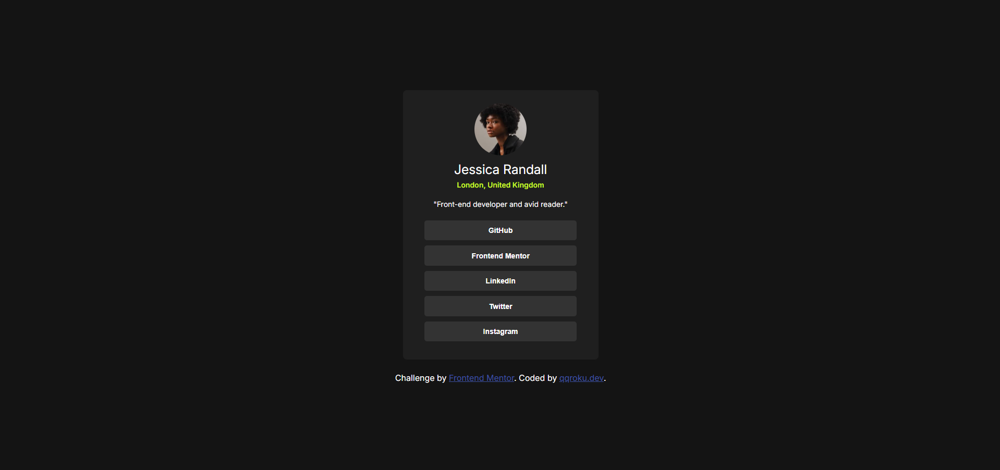
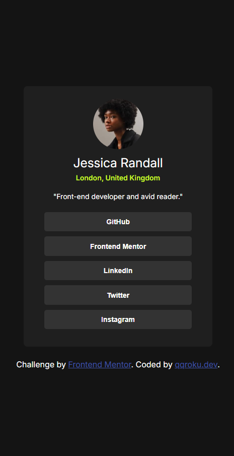

# Frontend Mentor - Social links profile solution

This is a solution to the [Social links profile challenge on Frontend Mentor](https://www.frontendmentor.io/challenges/social-links-profile-UG32l9m6dQ). Frontend Mentor challenges help you improve your coding skills by building realistic projects. 

## Table of contents

- [Overview](#overview)
  - [The challenge](#the-challenge)
  - [Screenshot](#screenshot)
  - [Links](#links)
- [My process](#my-process)
  - [Built with](#built-with)
  - [What I learned](#what-i-learned)
  - [Continued development](#continued-development)
- [Author](#author)

**Note: Delete this note and update the table of contents based on what sections you keep.**

## Overview

### The challenge

Users should be able to:

- See hover and focus states for all interactive elements on the page

### Screenshot

### At desktop view

### At mobile view

### Links

- Solution URL: [solution URL](https://github.com/qqroku/Social-links-profile) 
- Live Site URL: [live site URL](https://qqroku.github.io/Social-links-profile/)

## My process

### Built with

- Semantic HTML5 markup
- CSS custom properties
- Flexbox
- Mobile-first workflow

### What I learned

I became more familiar styling responsive cards using html and css.

### Continued development

responsive layouts.

## Author

- Github - [qqroku](https://github.com/qqroku)
- Frontend Mentor - [@qqroku](https://www.frontendmentor.io/profile/qqroku)
